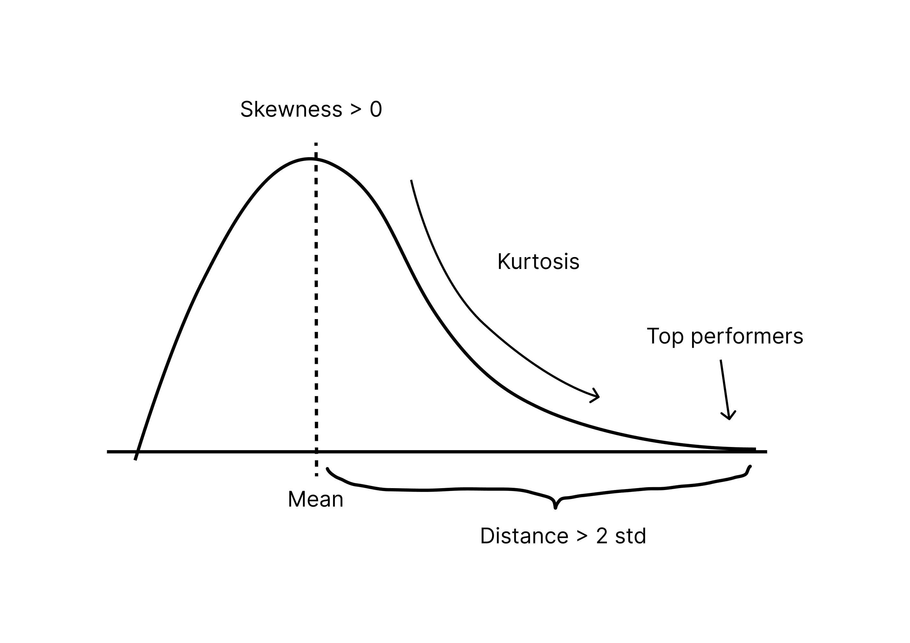
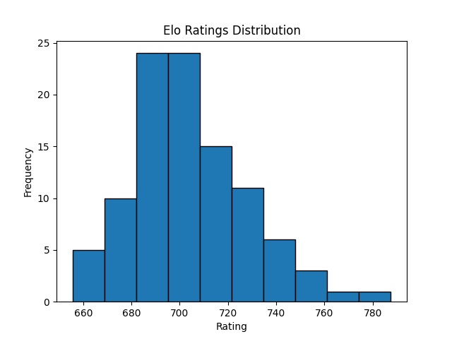
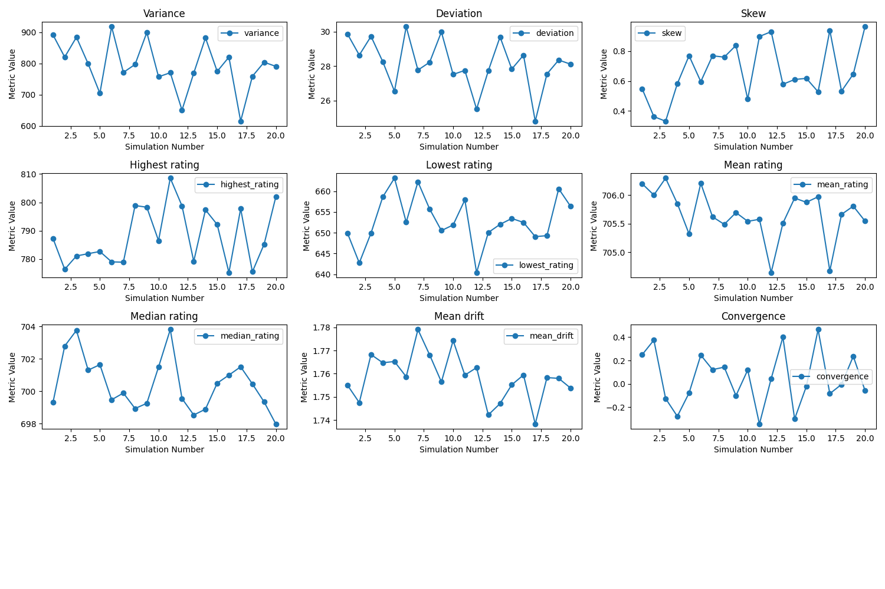

# Elo Simulation System

This project creates a sandbox for simulating elo rankings and finding the most suitable solutions for new areas where it wasn't used before. It includes not only simulation, but also experimenting with different elo and elo-like approaches, optimization for best parameters and construction of suitable metrics.

## Introduction

This project appeared as part of the idea to standardize Integration bees across different universities in the world. starting from integration bee Austria.
The Integration Bee is a prestige calculus competition requiring a precise, dynamic, and fair ranking system to evaluate participants' skill levels. This project adapts the Elo rating system to address the challenges posed by such competitions, ensuring meaningful updates to player rankings after each event while maintaining a balance between long-term stability and responsiveness to recent performances.

## The Elo Rating System

Elo is a method for calculating the relative skill levels of players in competitive games. Originally developed for chess, it assigns a numerical rating to each player, dynamically updated after every match based on expected and actual outcomes. The expected score uses a logistic curve to model the probability of one player defeating another, where the difference in ratings determines the skewness of the probability. Matches between equally rated players have a 50% expected score for each, while a significant rating gap results in a much higher expectation for the stronger player.

The update mechanism compares this expected score with the actual outcome and adjusts ratings proportionally. A parameter called the K-factor determines the sensitivity of the rating system. Higher K-factors allow ratings to shift more dramatically after a single match, while lower values prioritize stability over time.

To calculate Expected score we use following formula:


Where:
- E<sub>A</sub> - Expected score
- R<sub>A</sub> - Rating of the player A
- R<sub>B</sub> - Rating of the player B
- τ - Scaling parameter controlling sensitivity to rating differences

and to update ratings we use following formula:


Where:
- S<sub>A</sub> - is the actual score/result for player A on the interval from 0 to 1


## Specifics of integration bee

Integration bee competitions are rare and expensive events hosting only around 16 participants each time.
They also progress in complexity and overall skill levels. This means the rating has to be responsive, yet stable enough. It also has to account for the fact that recent wins have to be more valued than the old results.
Additionally, the higher win-loss margin will affect the change in rating more by adjusting the "actual result" in elo formula by using float values in range between 0 and 1 instead of 0 and 1 only.

**Usually problems** in later rounds tend to get more complex, and they last longer making them more fair which means that results there have to have more weight in comparison to e.g. 1/8 finals.
therefore we have introduced dynamic K that grows towards later rounds. Nevertheless, we kept the simulation flexible and few modes for K are available: 
  + `static` - K doesn't change over the tournament
  + `linear` - K grows linearly from min to max value
  + `sqrt` - K grows proportionally to square root (Default)
  + `log` - K grows logarithmically
  + `custom` - allows to provide custom scale for K factor

## Rating system

We use standard elo with adjustable tau and K parameters. We also adjust initial player's rating, since it remains unknown which one would suit this sport the most.

## Decay

We adjust to old-recent recent matches balance by introducing traditional for NBA decay factor. This means that over time, preferably once a season, we take all the results and make them approach the mean.


- In elo mean stays the same as initial ranking since elo represents a zero-sum ranking system.

### skew function 𝑓

#### Why Do We Need 𝑓?

The Elo system preserves a zero-sum property, where the mean rating remains constant over time. However, Elo ratings tend to follow a symmetrical distribution, which may not align with our goals:

- **Top Performers:** Higher ratings lack sufficient differentiation, making performance feel less rewarding.
- **Low Performers:** Ratings drop too far below the mean, discouraging participation.
- **Engagement:** A positively skewed distribution would make the system more engaging by rewarding top performers while keeping weaker players closer to the mean.

#### What We Tried Before

- **Adjusting 𝐾 Dynamically:**
We experimented with rating wins of players far from the mean significantly higher, while losses were scaled down using a sigmoid-based 
K adjustment. This resulted in positive skewness but disrupted the zero-sum nature of Elo. Over time, ratings either grew excessively high or low, leading to reduced variance and imbalance.

- **Streak-Based Multipliers:**
We introduced multipliers for players on winning streaks, making ratings more responsive to consecutive wins. However, this removed the zero-sum balance entirely and caused unpredictable shifts in ratings, failing to provide meaningful improvements.

- **Direct Rating Adjustments:**
We considered modifying the entire distribution at once to impose skewness. However, this felt arbitrary and overly subjective. Players would likely perceive such a change as unfair and inconsistent with Elo's transparent mechanics.


#### To address these issues, we developed a skew function 𝑓

**This allows us to:**

- Maintain the zero-sum nature of Elo for actual calculations.
- Introduce a positively skewed distribution for displayed ratings.
- Ensure fairness and transparency through a bijective transformation between displayed and actual ratings.

#### Requirements for 𝑓

- **Bijectivity:** As mentioned before, to allow transformation between actual and displayed ratings.
- **Controlled Skewness:** Increase ratings further from the mean while compressing those closer to it in a controllable manner.

#### Proposed Transformation:
The function 𝑓 and its inverse 𝑓 <sup> − 1 </sup> are defined as follows:

\mu\\(x-\mu)/\lambda&plus;\mu,&\text{if}\;x<\mu\\x,&\text{if}\;x=\mu\end{cases}" alt="elo expected score" />

\mu\\(y-\mu)\cdot\lambda&plus;\mu,&\text{if}\;y<\mu\\y,&\text{if}\;y=\mu\end{cases}" alt="elo expected score" />

Where:

𝜇: Static mean of the actual (Elo) ratings, equal to the initial mean rating.  
𝜆>1: Scaling factor controlling skewness

Updated Elo Formulas with 𝑓:

1. **Expected Score:**  

where **b** is the base, common values are e, 10 or 2


2. **Rating Update:**
  

4. Decay:


#### Benefits of this approach:
- **Preserves Zero-Sum:** Actual Elo ratings remain zero-sum, ensuring fairness and stability.
- **Engaging Display:** Displayed ratings provide positive skewness, motivating players across the skill spectrum.
- **Transparency:** The bijective nature of 𝑓 allows players to verify how displayed ratings are derived.
- **Flexibility:** Fully compatible with existing Elo modifications, such as dynamic 𝐾 and decay.

## Simulation

in order to see how the ranking performs, we simulate tournaments with players and look at statistical data afterward.

**Since tournament simulation cannot be vectorized by the nature of tournament itself**, some parts of the code were pre-compiled using cython to achieve fast runtime.

### Data bias problem

One of the main problems is creating players and matches. If we assume random performance we neglect the entire point of ranking - to decide who performs better and who performs worse.
Therefore, some players have to perform better, some have to perform worse

possible solutions here are: 
- introducing hidden "Skill" parameter, so that the players with higher skill win more often. Problem of such approach is that the way we distribute skill completely decides about the outcome
and the entire study becomes pointless. Additionally having this skill and deciding who wins using it basically is elo, so we are using elo to simulate elo, which has even less meaning.
- second option is the one we went for. We take real data from another sport and adjust it to fit our case. We took data that was the most available - football matches.
data has teams and over a century matches history. this way the final distribution is affected only by nature of sports and strength of real teams, allowing us to text the system in applied field.


## Adjustable parameters:

    - k
    - k_min
    - k_max
    - custom_k
    - decay_factor 
    - initial_score 
    - tau

## Scoring

to know which system performs the best a sophisticated hybrid metric was developed

To evaluate which ELO system performs best, we developed a hybrid metric combining several key statistical measures:

- Drift: Captures the responsiveness of the rating system to recent performances, with higher drift indicating a more dynamic system.
- Mean Absolute Change (MAC): Reflects stability by measuring the average rating fluctuations. Lower MAC indicates a steadier system.
- Skewness and Kurtosis: Evaluate the distribution of final ratings. Target skewness between 0 and 1.5 ensures slight positive asymmetry, while kurtosis between 3 and 5 promotes a balanced distribution.
- Convergence: Measures how quickly player ratings stabilize over time, ensuring predictability and fairness.
- difference between mean and top players performance: has to be around 2 standard deviations

The combined metric balances these aspects, promoting a system that is responsive to performance changes, stable, and fair, while maintaining desirable statistical properties. Constraints ensure the metric remains within realistic bounds for effective optimization.

however this doesn't ensure fulfillment of the criteria by the final metric, since it is random. We only try to find optimal one, that would approach the desirable parameters.

to reduce randomness in optimization, we run simulation few times and then average scores.

### Summary of goals

basically we want to achieve reasonably high convergence rate, and drift, and about following distribution of final ratings:



## Optimisation

To identify the most suitable parameters for our ELO system, we employ Bayesian optimization, a probabilistic model-based global optimization technique. This method is well-suited for optimizing objective functions that are expensive to evaluate or lack gradient information.

Bayesian optimization builds a surrogate model, typically a Gaussian Process (GP), to approximate the objective function. The GP not only predicts the value of the function at any input but also provides uncertainty estimates. These uncertainty estimates help balance two key strategies in optimization:

- Exploration: Sampling regions where the surrogate model is uncertain, to improve the model.
- Exploitation: Focusing on regions where the surrogate model predicts high performance.
- At each iteration, a new candidate point is chosen by maximizing an acquisition function, such as Expected Improvement (EI) or Upper Confidence Bound (UCB). The acquisition function uses both the mean and uncertainty of the GP to decide the next point to evaluate.

The iterative process can be summarized as:

1. Construct a surrogate model of the objective function.
2. Maximize the acquisition function to select the next candidate.
3. Evaluate the true objective function at the selected point.
4. Update the surrogate model with the new data.
5. Repeat until convergence or a predefined budget is met.

Bayesian optimization is particularly effective in our context, where evaluating the ELO metric involves computationally intensive simulations. By efficiently balancing exploration and exploitation, it minimizes the number of simulations needed to identify optimal parameters, making it an ideal choice for this task.


## Implementation
The simulation system is implemented in Python, leveraging libraries like NumPy for numerical computations, pandas for data management, and Matplotlib for visualizations. It also utilizes Cython to precompile performance-critical parts of the code, significantly improving runtime for large-scale simulations.

### Prepare the Environment
Clone the repository:

```bash
git clone <repository_url>
cd <repository_name>
```
Install the required dependencies:

```bash
pip install -r requirements.txt
```
Ensure you have a C compiler installed for compiling Cython. On Linux, use gcc, and on Windows, install Visual Studio Build Tools.

### Compile the Cython Module
The tournament simulation logic is precompiled using Cython for better performance. To compile the cython_run_tournament.pyx file, follow these steps:

Ensure the setup.py file is present in the root directory of the repository.

Compile the Cython file:

```bash
python setup.py build_ext --inplace
```
This will generate a shared object file (e.g., cython_run_tournament.cpython-<version>-<platform>.so) in the same directory.

Verify that the compilation succeeded:

```bash
python -c "import cython_run_tournament"
```
### Run the Simulation
To simulate tournaments and analyze results, execute main.py:

```bash
python main.py
```

**This script:**

Runs a predefined set of tournaments with the configured parameters.
Generates the following:
Ratings Statistics: Key metrics like variance, skewness, and convergence of player ratings.
Distribution Plot: A histogram showing the final ratings distribution (ratings_distribution.png).
Output File: Player ratings and other data saved in player_ratings.txt.
Run Optimization
To optimize the parameters of the Elo system using Bayesian optimization, execute optimizing.py:

```bash
python optimizing.py
```
**This script:**

Finds the best parameters (e.g., K-factor, decay factor, and transformation parameters).
Evaluates each parameter set using multiple simulations.
Outputs the optimal parameters and their performance score.

### Analyze Results:
The simulation generates an output file named player_results.txt, containing final ratings and match counts for all players.

#### Intermediary results without implementation

**with following parameters:**

```python
num_players = 100
players_per_tournament = 16  
num_tournaments = 1000  
base_k = 64  
k_min = 20  
k_max = 80  
decay_factor = 0 
initial_rating = 700  
tau = 80  
k_scaling = "linear"  
lam = 1.3
```

we get following results:





## Applications

This project is specifically designed for the Integration Bee but has broader applications in ranking systems for competitions. By simulating tournaments, users can evaluate the effectiveness of various configurations and refine the system for accuracy and fairness. The flexibility of the code makes it suitable for adapting to different competitive scenarios beyond mathematics.

## TODO

- Add plots and diagrams
- Add results

## License

This project is licensed under the MIT License. For more details, refer to the LICENSE file in the repository.
